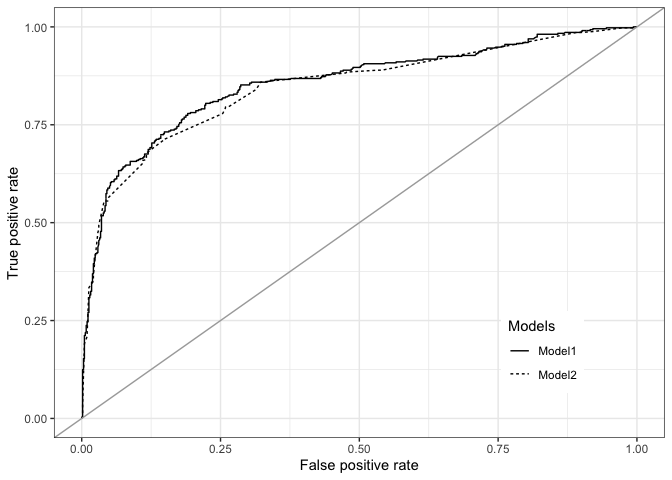

Use logit regression models to predict Titanic passenger survival
================
Fiona, Fang Jiaying
2022-11-9

# Preparation

## Packages

``` r
pacman::p_load(tidyverse, haven, stargazer, tidymodels, ranger, modelsummary, dplyr, modeldata, pscl, pROC)
```

## Data

We load the Titanic data.

``` r
td <- read.csv("titanic.csv")
```

We need to clean up the data to prepare for data analysis.

Let’s first explore the target variables (survived).

``` r
with(td, table(survived, useNA = "ifany"))
```

    ## survived
    ##   0   1 
    ## 809 500

There is no missing value in the dependent variable.

Then, {tidymodels} require that the dependent variable is stored as a
factor variable (categorical variable) when we do classification.
Therefore, we should change the data type.

``` r
td <- td |> 
  mutate(survived_fac = factor(survived))

with(td, table(survived, survived_fac, useNA = "ifany"))
```

    ##         survived_fac
    ## survived   0   1
    ##        0 809   0
    ##        1   0 500

Let’s check if there’s any missing value in data test.

``` r
colSums(is.na(td))
```

    ##     survived         name       pclass          age        child          old 
    ##            0            0            0          263          263          263 
    ##          sex        sibsp        parch        alone         fare    cherbourg 
    ##            0            0            0            0            1            2 
    ##   queenstown  southampton survived_fac 
    ##            2            2            0

Drop observations with missing values.

``` r
td.nna <- td |> 
        dplyr::select(survived_fac, pclass, age, child, old, sex, sibsp, parch, alone, fare, cherbourg, queenstown, southampton) |> 
        na.omit()

colSums(is.na(td.nna))
```

    ## survived_fac       pclass          age        child          old          sex 
    ##            0            0            0            0            0            0 
    ##        sibsp        parch        alone         fare    cherbourg   queenstown 
    ##            0            0            0            0            0            0 
    ##  southampton 
    ##            0

Then, we want to use logit regression models to predict Titanic
passenger survival.

# Logit Models

Run the logit models to view the results

``` r
td.nna <- td.nna |> 
  mutate(pclass = factor(pclass))

mod1 <- glm(survived_fac ~., family = binomial(link = 'logit'), data = td.nna)

stargazer(mod1, type = "text",
          dep.var.labels=c("Likelihood of survival"),
          covariate.labels=c("pclass2",
                             "pclass3",
                             "Age",
                             "Child", 
                             "Old",
                             "Woman",
                             "Number of siblings or spouses",
                             "Number of parents or children",
                             "Alone",
                             "Fare",
                             "Departure from Cherbourg",
                             "Departure from Queenstown",
                             "Departure from Southampton"))
```

    ## 
    ## =========================================================
    ##                                   Dependent variable:    
    ##                               ---------------------------
    ##                                 Likelihood of survival   
    ## ---------------------------------------------------------
    ## pclass2                                -1.013***         
    ##                                         (0.271)          
    ##                                                          
    ## pclass3                                -1.878***         
    ##                                         (0.282)          
    ##                                                          
    ## Age                                    -0.023**          
    ##                                         (0.011)          
    ##                                                          
    ## Child                                  1.094***          
    ##                                         (0.393)          
    ##                                                          
    ## Old                                     -0.161           
    ##                                         (0.382)          
    ##                                                          
    ## Woman                                  2.591***          
    ##                                         (0.183)          
    ##                                                          
    ## Number of siblings or spouses          -0.634***         
    ##                                         (0.144)          
    ##                                                          
    ## Number of parents or children           -0.162           
    ##                                         (0.123)          
    ##                                                          
    ## Alone                                  -0.629**          
    ##                                         (0.254)          
    ##                                                          
    ## Fare                                     0.001           
    ##                                         (0.002)          
    ##                                                          
    ## Departure from Cherbourg                0.547**          
    ##                                         (0.220)          
    ##                                                          
    ## Departure from Queenstown               -0.678*          
    ##                                         (0.412)          
    ##                                                          
    ## Departure from Southampton                               
    ##                                                          
    ##                                                          
    ## Constant                                0.907*           
    ##                                         (0.493)          
    ##                                                          
    ## ---------------------------------------------------------
    ## Observations                             1,043           
    ## Log Likelihood                         -469.676          
    ## Akaike Inf. Crit.                       965.352          
    ## =========================================================
    ## Note:                         *p<0.1; **p<0.05; ***p<0.01

From the result, we can see that pclass, age, child, woman, Alone,
cherbourg, sibspp, and queenstown are significant features for
predicting survival outcome. For instance, one-unit increase in age will
decrease the log odd of survival by 0.023.

# Models: logit regression

Then, we try to figure out the best model.

``` r
td.nna <- td.nna |> 
  mutate(pclass = factor(pclass))

fit1 <- logistic_reg() |> 
  fit(survived_fac ~ pclass + age + child + old + 
        sex + sibsp + parch + alone + fare + 
        cherbourg + queenstown + southampton, 
      data = td.nna)

fit2 <- logistic_reg() |> 
  fit(survived_fac ~ pclass + child + sex + sibsp, 
      data = td.nna) 

fit3 <- logistic_reg() |> 
  fit(survived_fac ~ pclass + child + sex + sibsp +  
                  age + cherbourg + alone, 
      data = td.nna) 

fit4 <- logistic_reg() |> 
  fit(survived_fac ~ pclass + child + sex + sibsp +  
                  age + cherbourg + alone+ 
               queenstown, 
      data = td.nna) 

fit5 <- logistic_reg() |> 
  fit(survived_fac ~ pclass + child + sex + sibsp +  
                  age  + cherbourg + alone + 
                  queenstown + parch, 
      data = td.nna) 


modelsummary(list(fit1, fit2, fit3, fit4, fit5),
             coef_rename = c(
               "(Intercept)" = "Intercept", 
               "pclass" = "",
               "age" = "Age",
               "childChild" = "Child", 
               "old" = "Old",
               "sexWoman" = "Woman",
               "sibsp" = "Number of siblings or spouses",
               "parch" = "Number of parents or children",
               "alone" = "Alone",
               "fare" = "Fare",
               "cherbourg" = "Departure from Cherbourg",
               "queenstown" = "Departure from Queenstown",
               "southampton" = "Departure from Southampton"))
```

|                               |   \(1\) |   \(2\) |   \(3\) |   \(4\) |   \(5\) |
|:------------------------------|--------:|--------:|--------:|--------:|--------:|
| Intercept                     |   0.907 |  -0.234 |   0.956 |   0.950 |   1.041 |
|                               | (0.493) | (0.156) | (0.416) | (0.417) | (0.424) |
| pclass2                       |  -1.013 |  -1.052 |  -1.043 |  -1.060 |  -1.053 |
|                               | (0.271) | (0.213) | (0.242) | (0.244) | (0.244) |
| pclass3                       |  -1.878 |  -1.942 |  -1.993 |  -1.958 |  -1.927 |
|                               | (0.282) | (0.200) | (0.240) | (0.241) | (0.242) |
| Age                           |  -0.023 |         |  -0.027 |  -0.027 |  -0.026 |
|                               | (0.011) |         | (0.008) | (0.008) | (0.008) |
| Child                         |   1.094 |   1.737 |   0.937 |   0.927 |   1.020 |
|                               | (0.393) | (0.297) | (0.353) | (0.353) | (0.362) |
| Old                           |  -0.161 |         |         |         |         |
|                               | (0.382) |         |         |         |         |
| Woman                         |   2.591 |   2.608 |   2.514 |   2.563 |   2.592 |
|                               | (0.183) | (0.171) | (0.176) | (0.181) | (0.183) |
| Number of siblings or spouses |  -0.634 |  -0.451 |  -0.611 |  -0.614 |  -0.630 |
|                               | (0.144) | (0.108) | (0.140) | (0.141) | (0.143) |
| Number of parents or children |  -0.162 |         |         |         |  -0.150 |
|                               | (0.123) |         |         |         | (0.120) |
| Alone                         |  -0.629 |         |  -0.527 |  -0.488 |  -0.630 |
|                               | (0.254) |         | (0.225) | (0.227) | (0.254) |
| Fare                          |   0.001 |         |         |         |         |
|                               | (0.002) |         |         |         |         |
| Departure from Cherbourg      |   0.547 |         |   0.598 |   0.574 |   0.559 |
|                               | (0.220) |         | (0.216) | (0.217) | (0.217) |
| Departure from Queenstown     |  -0.678 |         |         |  -0.665 |  -0.677 |
|                               | (0.412) |         |         | (0.410) | (0.411) |
| Num.Obs.                      |    1043 |    1043 |    1043 |    1043 |    1043 |
| AIC                           |   965.4 |   983.4 |   962.0 |   961.3 |   961.6 |
| BIC                           |  1029.7 |  1013.1 |  1006.5 |  1010.7 |  1016.1 |
| RMSE                          |    0.38 |    0.38 |    0.38 |    0.38 |    0.38 |

# Cross validation

We use 5-fold cross validation (outof-sample prediction) to decide the
best model.

``` r
set.seed(12345)
cv_fold <- vfold_cv(td.nna, v = 5)
```

``` r
fit.1_cv <- logistic_reg() |> 
  fit_resamples(survived_fac ~ pclass + age + child + old + 
        sex + sibsp + parch + alone + fare + 
        cherbourg + queenstown + southampton, 
                resamples = cv_fold)
```

    ## → A | warning: prediction from a rank-deficient fit may be misleading

    ## There were issues with some computations   A: x1There were issues with some computations   A: x3There were issues with some computations   A: x5

``` r
collect_metrics(fit.1_cv)
```

    ## # A tibble: 2 × 6
    ##   .metric  .estimator  mean     n std_err .config             
    ##   <chr>    <chr>      <dbl> <int>   <dbl> <chr>               
    ## 1 accuracy binary     0.789     5  0.0136 Preprocessor1_Model1
    ## 2 roc_auc  binary     0.851     5  0.0127 Preprocessor1_Model1

``` r
fit.2_cv <- logistic_reg() |> 
  fit_resamples(survived_fac ~ pclass + child + sex + sibsp, 
                resamples = cv_fold)

collect_metrics(fit.2_cv)
```

    ## # A tibble: 2 × 6
    ##   .metric  .estimator  mean     n std_err .config             
    ##   <chr>    <chr>      <dbl> <int>   <dbl> <chr>               
    ## 1 accuracy binary     0.795     5  0.0109 Preprocessor1_Model1
    ## 2 roc_auc  binary     0.843     5  0.0126 Preprocessor1_Model1

``` r
fit.3_cv <- logistic_reg() |> 
  fit_resamples(survived_fac ~ pclass + child + sex + sibsp +  
                  age + cherbourg + alone, 
                resamples = cv_fold)

collect_metrics(fit.3_cv)
```

    ## # A tibble: 2 × 6
    ##   .metric  .estimator  mean     n std_err .config             
    ##   <chr>    <chr>      <dbl> <int>   <dbl> <chr>               
    ## 1 accuracy binary     0.795     5  0.0128 Preprocessor1_Model1
    ## 2 roc_auc  binary     0.851     5  0.0135 Preprocessor1_Model1

``` r
fit.4_cv <- logistic_reg() |> 
  fit_resamples(survived_fac ~ pclass + child + sex + sibsp +  
                  age + cherbourg + alone +
                  queenstown, 
                resamples = cv_fold)

collect_metrics(fit.4_cv)
```

    ## # A tibble: 2 × 6
    ##   .metric  .estimator  mean     n std_err .config             
    ##   <chr>    <chr>      <dbl> <int>   <dbl> <chr>               
    ## 1 accuracy binary     0.795     5  0.0155 Preprocessor1_Model1
    ## 2 roc_auc  binary     0.852     5  0.0130 Preprocessor1_Model1

``` r
fit.5_cv <- logistic_reg() |> 
  fit_resamples(survived_fac ~ pclass + child + sex + sibsp +  
                  age  + cherbourg + alone + 
                  queenstown + parch, 
                resamples = cv_fold)

collect_metrics(fit.5_cv)
```

    ## # A tibble: 2 × 6
    ##   .metric  .estimator  mean     n std_err .config             
    ##   <chr>    <chr>      <dbl> <int>   <dbl> <chr>               
    ## 1 accuracy binary     0.794     5  0.0128 Preprocessor1_Model1
    ## 2 roc_auc  binary     0.852     5  0.0130 Preprocessor1_Model1

The mean of roc_auc of fit 5 is the largest here. Thus, it is the best
model to choose.

# Evaluating performances

Calculate predicted probabilities.

``` r
pred_logit_1 <- predict(fit1, td.nna, type = "prob")
```

    ## Warning in predict.lm(object, newdata, se.fit, scale = 1, type = if (type == :
    ## prediction from a rank-deficient fit may be misleading

``` r
pred_df_logit_1 <- data.frame(survived_fac = td.nna $ survived_fac, pred_logit_1) 

pred_logit_2 <- predict(fit2, td.nna, type = "prob")
pred_df_logit_2 <- data.frame(survived_fac = td.nna $ survived_fac, pred_logit_2) 

pred_logit_3 <- predict(fit3, td.nna, type = "prob")
pred_df_logit_3 <- data.frame(survived_fac = td.nna $ survived_fac, pred_logit_3) 

pred_logit_4 <- predict(fit4, td.nna, type = "prob")
pred_df_logit_4 <- data.frame(survived_fac = td.nna $ survived_fac, pred_logit_4) 

pred_logit_5 <- predict(fit5, td.nna, type = "prob")
pred_df_logit_5 <- data.frame(survived_fac = td.nna $ survived_fac, pred_logit_5) 
```

Create a ROC figure that compares the five models

``` r
roc_logit_1 <- roc(pred_df_logit_1 $ survived_fac ~ 
                   pred_df_logit_1 $.pred_1 + 
                   pred_df_logit_2 $.pred_1, ci = TRUE)
```

    ## Setting levels: control = 0, case = 1

    ## Setting direction: controls < cases

    ## Setting levels: control = 0, case = 1

    ## Setting direction: controls < cases

``` r
roc_logit_2 <- roc(pred_df_logit_1 $ survived_fac ~ 
                   pred_df_logit_1 $.pred_1 + 
                   pred_df_logit_3 $.pred_1, ci = TRUE)
```

    ## Setting levels: control = 0, case = 1
    ## Setting direction: controls < cases

    ## Setting levels: control = 0, case = 1

    ## Setting direction: controls < cases

``` r
roc_logit_3 <- roc(pred_df_logit_1 $ survived_fac ~ 
                   pred_df_logit_1 $.pred_1 + 
                   pred_df_logit_4 $.pred_1, ci = TRUE)
```

    ## Setting levels: control = 0, case = 1
    ## Setting direction: controls < cases

    ## Setting levels: control = 0, case = 1

    ## Setting direction: controls < cases

``` r
roc_logit_4 <- roc(pred_df_logit_1 $ survived_fac ~ 
                   pred_df_logit_1 $.pred_1 + 
                   pred_df_logit_5 $.pred_1, ci = TRUE)
```

    ## Setting levels: control = 0, case = 1
    ## Setting direction: controls < cases

    ## Setting levels: control = 0, case = 1

    ## Setting direction: controls < cases

ROC curves together:

``` r
ggroc(roc_logit_1, 
      legacy.axes = TRUE, aes = c("linetype")) + 
        geom_abline(color = "dark grey", size = 0.5) + 
        labs(x = "False positive rate", 
             y = "True positive rate",
             linetype="Models") + 
        scale_linetype_discrete(labels=c("Model1", "Model2")) + 
  theme_bw() + 
        theme(legend.position=c(0.8,0.2))
```

    ## Warning: Using `size` aesthetic for lines was deprecated in ggplot2 3.4.0.
    ## ℹ Please use `linewidth` instead.
    ## This warning is displayed once every 8 hours.
    ## Call `lifecycle::last_lifecycle_warnings()` to see where this warning was
    ## generated.

<!-- -->

``` r
ggroc(roc_logit_2, 
      legacy.axes = TRUE, aes = c("linetype")) + 
        geom_abline(color = "dark grey", size = 0.5) + 
        labs(x = "False positive rate", 
             y = "True positive rate",
             linetype="Models") + 
        scale_linetype_discrete(labels=c("Model1", "Model3")) + 
  theme_bw() + 
        theme(legend.position=c(0.8,0.2))
```

<!-- -->

``` r
ggroc(roc_logit_3, 
      legacy.axes = TRUE, aes = c("linetype")) + 
        geom_abline(color = "dark grey", size = 0.5) + 
        labs(x = "False positive rate", 
             y = "True positive rate",
             linetype="Models") + 
        scale_linetype_discrete(labels=c("Model1","Model4")) + 
  theme_bw() + 
        theme(legend.position=c(0.8,0.2))
```

<!-- -->

``` r
ggroc(roc_logit_4, 
      legacy.axes = TRUE, aes = c("linetype")) + 
        geom_abline(color = "dark grey", size = 0.5) + 
        labs(x = "False positive rate", 
             y = "True positive rate",
             linetype="Models") + 
        scale_linetype_discrete(labels=c("Model1","Model5")) + 
  theme_bw() + 
        theme(legend.position=c(0.8,0.2))
```

<!-- -->

Test if the AUCs are different:

``` r
roc.test(roc1 = roc_logit_1[[1]], 
         roc2 = roc_logit_1[[2]], method = "delong")
```

    ## 
    ##  DeLong's test for two correlated ROC curves
    ## 
    ## data:  roc_logit_1[[1]] and roc_logit_1[[2]]
    ## Z = 2.2758, p-value = 0.02286
    ## alternative hypothesis: true difference in AUC is not equal to 0
    ## 95 percent confidence interval:
    ##  0.001317432 0.017666006
    ## sample estimates:
    ## AUC of roc1 AUC of roc2 
    ##   0.8545288   0.8450371

``` r
roc.test(roc1 = roc_logit_2[[1]], 
         roc2 = roc_logit_2[[2]], method = "delong")
```

    ## 
    ##  DeLong's test for two correlated ROC curves
    ## 
    ## data:  roc_logit_2[[1]] and roc_logit_2[[2]]
    ## Z = 0.81062, p-value = 0.4176
    ## alternative hypothesis: true difference in AUC is not equal to 0
    ## 95 percent confidence interval:
    ##  -0.001749059  0.004216221
    ## sample estimates:
    ## AUC of roc1 AUC of roc2 
    ##   0.8545288   0.8532953

``` r
roc.test(roc1 = roc_logit_3[[1]], 
         roc2 = roc_logit_3[[2]], method = "delong")
```

    ## 
    ##  DeLong's test for two correlated ROC curves
    ## 
    ## data:  roc_logit_3[[1]] and roc_logit_3[[2]]
    ## Z = 0.26427, p-value = 0.7916
    ## alternative hypothesis: true difference in AUC is not equal to 0
    ## 95 percent confidence interval:
    ##  -0.001526884  0.002002803
    ## sample estimates:
    ## AUC of roc1 AUC of roc2 
    ##   0.8545288   0.8542909

``` r
roc.test(roc1 = roc_logit_4[[1]], 
         roc2 = roc_logit_4[[2]], method = "delong")
```

    ## 
    ##  DeLong's test for two correlated ROC curves
    ## 
    ## data:  roc_logit_4[[1]] and roc_logit_4[[2]]
    ## Z = -1.4405, p-value = 0.1497
    ## alternative hypothesis: true difference in AUC is not equal to 0
    ## 95 percent confidence interval:
    ##  -0.0011009745  0.0001681742
    ## sample estimates:
    ## AUC of roc1 AUC of roc2 
    ##   0.8545288   0.8549952

We can see from above that AUCROC of Model 5 is the largest. Thus, it is
the best model to choose.
